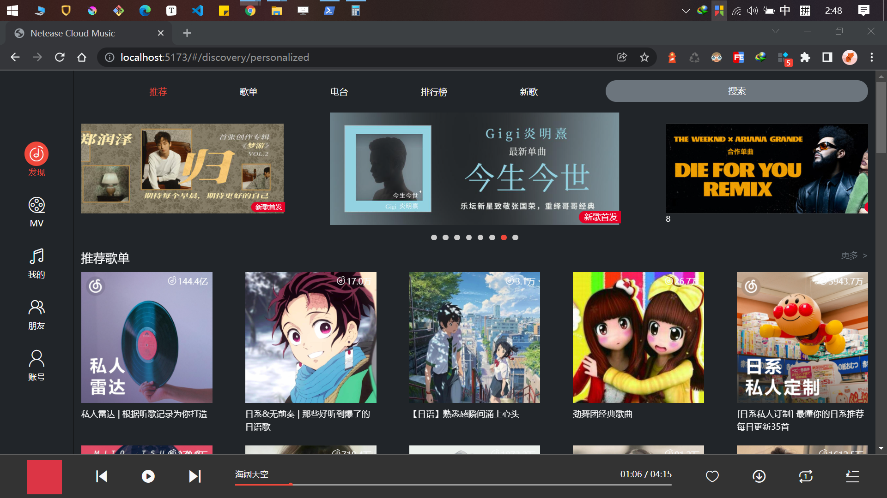
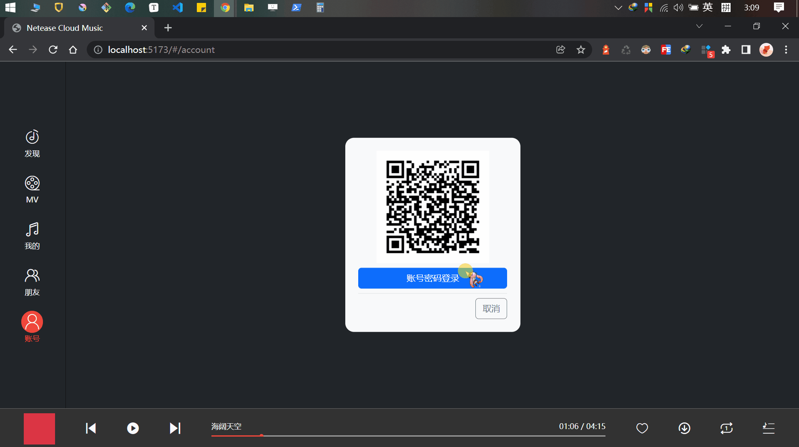
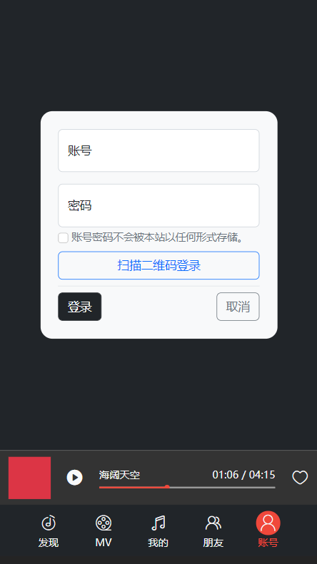

# 简版 网易云音乐



## 介绍

- 仅作为练习使用；
- 没有部署服务器，可通过视频、gif 预览效果，或者下载到本地启动 api；
- api 来源 [网易云 api](https://github.com/Binaryify/NeteaseCloudMusicApi)，其需要 NodeJS 12+ 环境。


## 视频预览

<iframe src="//player.bilibili.com/player.html?aid=822488713&bvid=BV1Wg4y1H7zQ&cid=1024554571&page=1" scrolling="no" border="0" frameborder="no" framespacing="0" allowfullscreen="true"> </iframe>

> [B 站播放链接]( https://www.bilibili.com/video/BV1Wg4y1H7zQ/?share_source=copy_web&vd_source=54f35a86bfb772bf2716924cf109b851)


## 图片预览




|  |  |  |
| ----------------------------- | ----------------------------- | ----------------------------- |


## 本地预览

### 下载

```shell
$ git clone git@github.com:jiangyu5/netease-cloud-music.git
$ cd netease-cloud-music
$ npm install
```

### 安装 - api

在 `src/` 下 创建 `api 文件夹`

```shell
$ cd src
$ mkdir api
```

继续安装 `api` 

```shell
$ git clone git@github.com:Binaryify/NeteaseCloudMusicApi.git
$ cd NeteaseCloudMusicApi
$ npm install
```

### 运行 - api

```shell
$ node app.js
```

> api Github 地址：[网易云 api](https://github.com/Binaryify/NeteaseCloudMusicApi)

### 预览

```shell
$ cd ../../../
$ npm run dev
# 或者
$ npx vite
```


